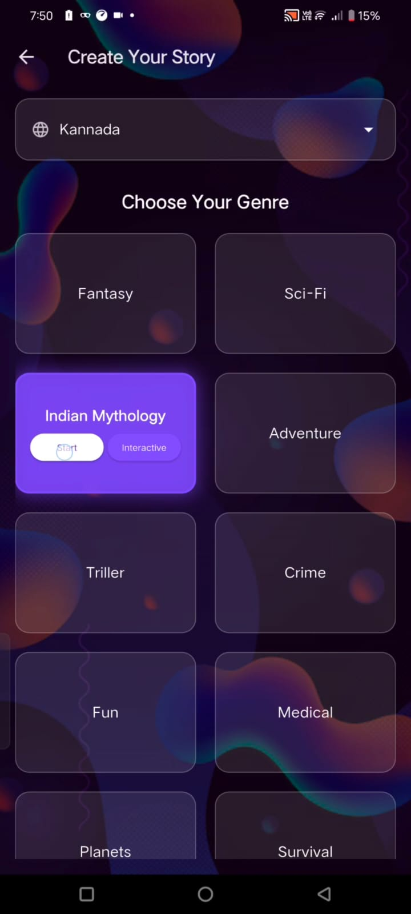
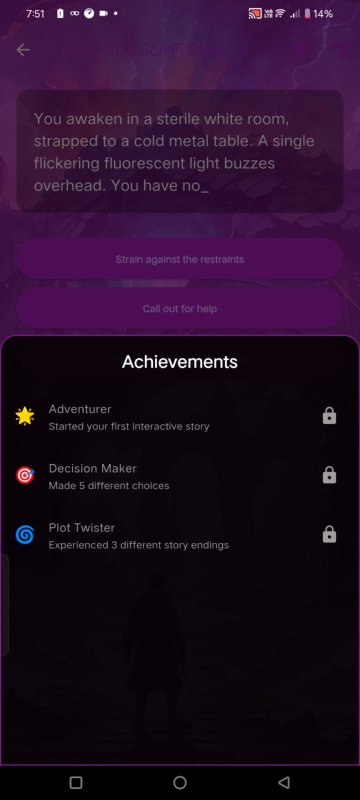

# 🍂 Story Narrator

Story Narrator is a magical, Generative AI-powered storytelling application designed specifically for kids! Dive into a world where imagination knows no bounds, with interactive stories, custom themes, and a safe, engaging environment.

## Features

### Custom Themes
Choose your adventure! Select from a variety of exciting themes including:
-   **Sci-Fi**: Explore the galaxies and beyond!
-   **Mythology**: Meet legendary creatures and heroes.
-   **Adventure**: Embark on thrilling quests.
-   **Fantasy**: Cast spells and visit enchanted kingdoms.



### Smart AI Storyteller
Our friendly AI narrator retells classic tales and creates new ones based on your chosen themes, making every storytime unique and special.


### Be Your Own Story Creator
Unleash your creativity with our interactive "Be Your Own Story Creator" mode!
1.  **Start the Journey**: The AI sets the scene with a fun opening.
2.  **Make Choices**: You'll be presented with 3-4 exciting options at key moments.
3.  **Branching Paths**: Every choice leads to a different path, creating a unique story every time!
4.  **Unlock Creativity**: Experiment with different choices to see all the possible outcomes!


### Voice Narration
Sit back and listen! The app features engaging voice narration (Text-to-Speech) that brings every character and scene to life, making it accessible and fun for everyone.

### Kid-Safe & Accessible
-   **Safe Content**: All stories are strictly filtered to ensure they are age-appropriate, with no offensive or adult language.
-   **Simple UX**: Designed with simplicity in mind, making it easy for kids to navigate and enjoy independently.

### Achievements
Track your reading progress and unlock fun achievements!



## Getting Started

This app is built using **Flutter**. To get started locally:

1.  **Clone the repository**:
    ```bash
    git clone https://github.com/MadhankumarAI/Storynarrator_app.git
    ```

2.  **Install dependencies**:
    ```bash
    flutter pub get
    ```

3.  **Run the app**:
    ```bash
    flutter run
    ```

## Tech Stack
-   **Framework**: Flutter
-   **AI**: Generative AI Integration (e.g., Gemini, OpenAI)
-   **Voice**: Text-to-Speech (TTS)

## License
This project is licensed under the MIT License - see the [LICENSE](LICENSE) file for details.

---
*Built with love for the storytellers of tomorrow.*
